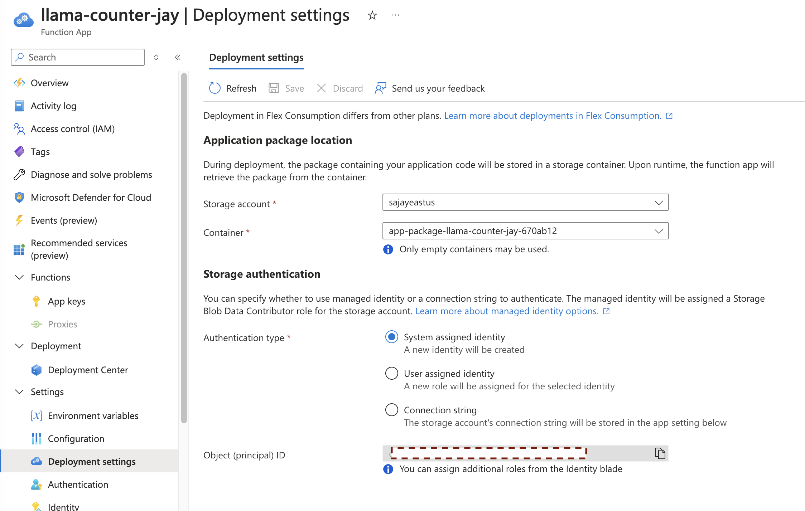
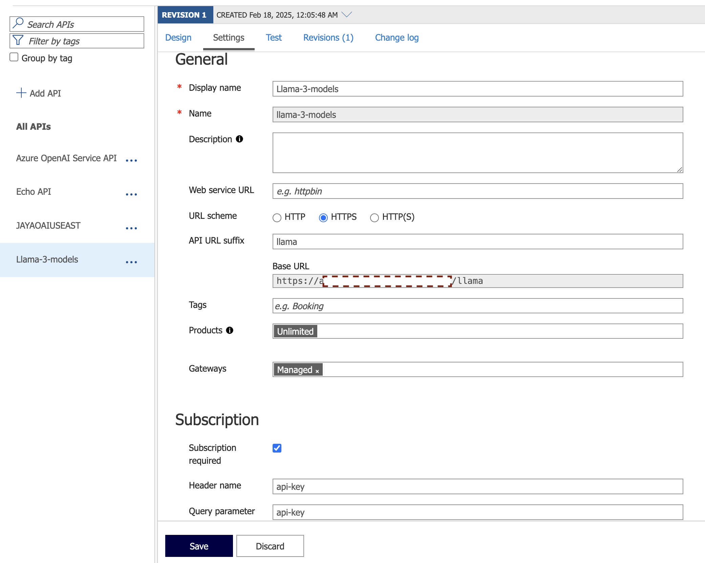
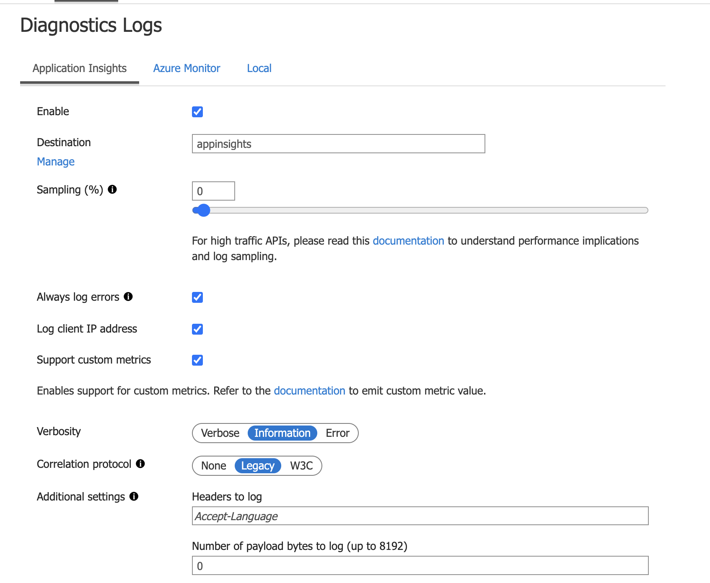
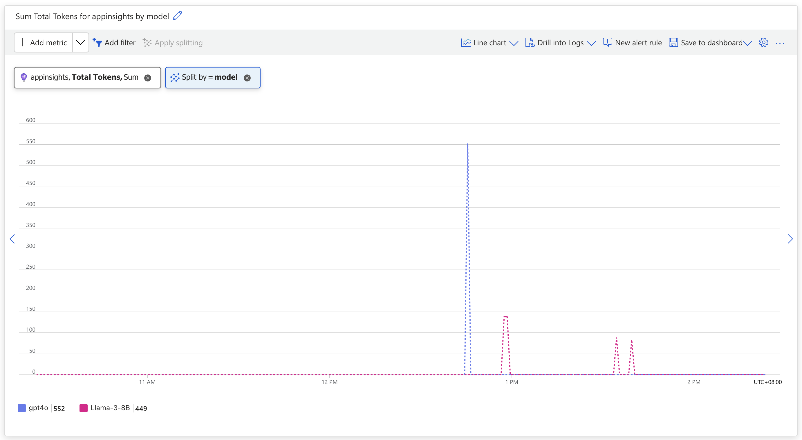

# LLM Token Counter Using Azure Function in Azure API Management

Self-hosted models or open-source models often lack the capability to track usage metrics. This example is to demonstrate how to count the tokens of the chat completion in Azure API Management.

This example demonstrates how to count the tokens of the chat completion in Azure API Management.

Key components of this example are:

- Azure Functions to count the tokens of the chat completion
- Azure API Management `send-request` policy to call the Azure Function
- Azure API Management `emit-metric` policy to emit the total tokens to Azure App Insights as Custom Metrics

Llama-3-8B is used as an example (though it does return the token count in the response), and basic method here can be applied to any other models as well.

## AutoTokenizer

AutoTokenizer from Hugging Face is used to count the tokens of the chat completion. The tokenizer is loaded from the model hub using the model name. If model of your choice is gated model, you will need to first go to the model page and request access. Llama 3 models are gated models, so this is required pre-requisite.


## Deploy Azure Function

Highly recommend to use Managed Identity for Storage Account with Azure Function. (https://techcommunity.microsoft.com/blog/appsonazureblog/use-managed-identity-instead-of-azurewebjobsstorage-to-connect-a-function-app-to/3657606)



```bash
func azure functionapp publish llama-counter-jay
```


## Azure API Management Policy

In order to emit metrics to Azure App Insights, we need to configure App Insights as a diagnostic setting in Azure API Management. 





The following policy is an example of how to emit metrics to App Insights.

```xml
<policies>
    <!-- Throttle, authorize, validate, cache, or transform the requests -->
    <inbound>
        <set-backend-service base-url="https://models.inference.ai.azure.com" />
        <set-header name="Authorization" exists-action="override">
            <value>Bearer {{GITHUB-TOKEN}}</value>
        </set-header>
    </inbound>
    <!-- Control if and how the requests are forwarded to services  -->
    <backend>
        <base />
    </backend>
    <!-- Customize the responses -->
    <outbound>
        <base />
        <send-request mode="new" response-variable-name="usage" timeout="20" ignore-error="true">
            <set-url>https://[Function_URL]/api/tokencounter</set-url>
            <set-method>POST</set-method>
            <set-header name="Content-Type" exists-action="override">
                <value>application/json</value>
            </set-header>
            <set-body>@{
                    return new JObject(
                            new JProperty("RequestBody", context.Request.Body.As<string>(preserveContent: true)),
                            new JProperty("ResponseBody", context.Response.Body.As<string>(preserveContent: true))
                        ).ToString(Newtonsoft.Json.Formatting.None);
                    }</set-body>
        </send-request>
        <set-variable name="totalTokens" value="@{
                var usage = ((IResponse)context.Variables["usage"]).Body.As<JObject>(preserveContent: true).ToString();
                var responseBody = JObject.Parse(usage);
                var totalTokens = responseBody["usage"]["total_tokens"].ToObject<string>();
                return totalTokens.ToString();
        }" />
        <emit-metric name="Total Tokens" value="@(Convert.ToDouble(context.Variables.GetValueOrDefault<string>("totalTokens")))" namespace="apimjayaoai">
            <dimension name="Subscription ID" />
            <dimension name="Client IP" value="@(context.Request.IpAddress)" />
            <dimension name="model" value="Llama-3-8B" />
        </emit-metric>
    </outbound>
    <!-- Handle exceptions and customize error responses  -->
    <on-error>
        <base />
    </on-error>
</policies>
```

. GITHUB-TOKEN: This is the PAT to access GitHub Models. You can create a PAT from your GitHub account.

## Metrics on App Insights


